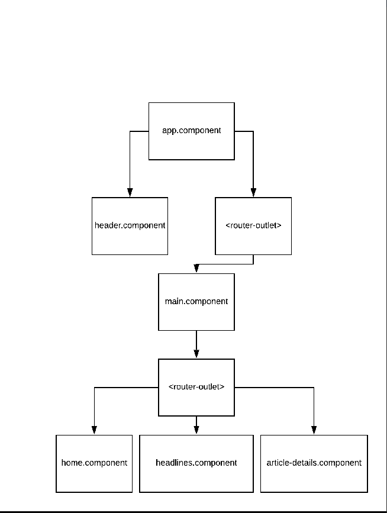

# NewstellerApp

This project was generated with [Angular CLI](https://github.com/angular/angular-cli) version 9.1.0.

## Components Infrastructure

## Development server

Run `npm start` for a dev server. Navigate to `http://localhost:4200/`. The app will automatically reload if you change any of the source files.

## Material Design

This project layout is designed by [Angular Material](https://material.angular.io/) version 9.2.0 and [MDBootstrap Angular](https://mdbootstrap.com/) version 9.0.1.

## Remarks

- Using the concept of lazy loading for loading modules.
- Using InputService to publish and subscribe values between components. 
